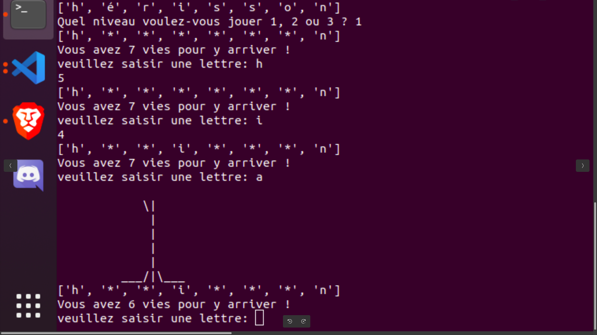

# Pendu

Ce dépôt contient backend du jeu du pendu .
Un jeu connu de tous qui me permet d'apprendre des nouveaux modules et librairie de python .

## Features

- Lancer le jeu
- Choisir un niveau pour jouer
- Jouer en proposant des lettres.
- A chaque mauvaise tentative le pendu commence à être dessiné .

## Tech

- [Python] - Pour l'algorythme avec une variété de modules: - setuptools : Pour packager le programme - random : module de tirage aléatoire - unittest : Pour effectuer des test unitaire - logging : Pour afficher des des logging régulierement lors de l'execution du code

## Installation

1- Cloner ce repository en local
2- Executer cette commande pour lancer l'éxecution du jeu : pendu_youcef

## Developement

1- Faire un front_end pour mon jeu pour le rendre plus agréable

## Templete

